###Kumarcode.com
I have decided to dedicate a post on the layout of this website. If someone
looking for a Jekyll template wants to use my website, they can follow the
instructions here on how to personalize their website. I will be outlining the
features I worked on and how you can make a few simple changes to personalize
them as your own.

###First thing is first: fork my template

If you do not have Jekyll or have not yet forked my repository, I recommend that you see my post regarding how to
get started <a href="http://kumarcode.com/How-to-make-your-own-blog/">here.</a>

###Get your own local copy

```bash
mkdir MyWebsite
cd MyWebsite
git init
git clone https://github.com/[username]/[username].github.io

```

###My Jekyll Template

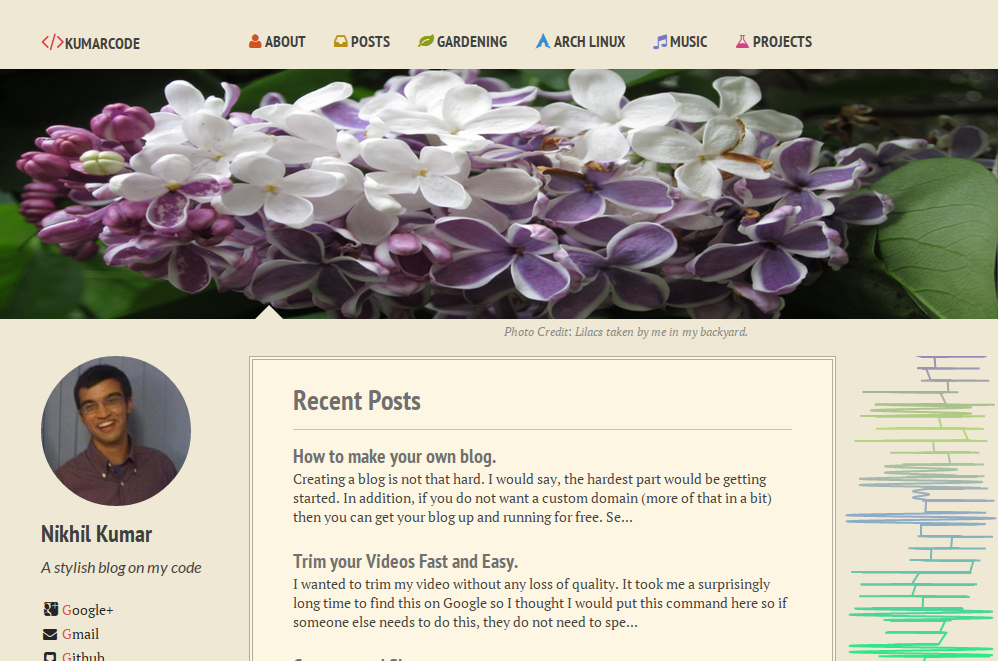

I use the `solarized light` color scheme. This helps keep the website clear, legible, and easy on the eyes. This website won't hurt your eyes when you open it up in a dark room at night. 

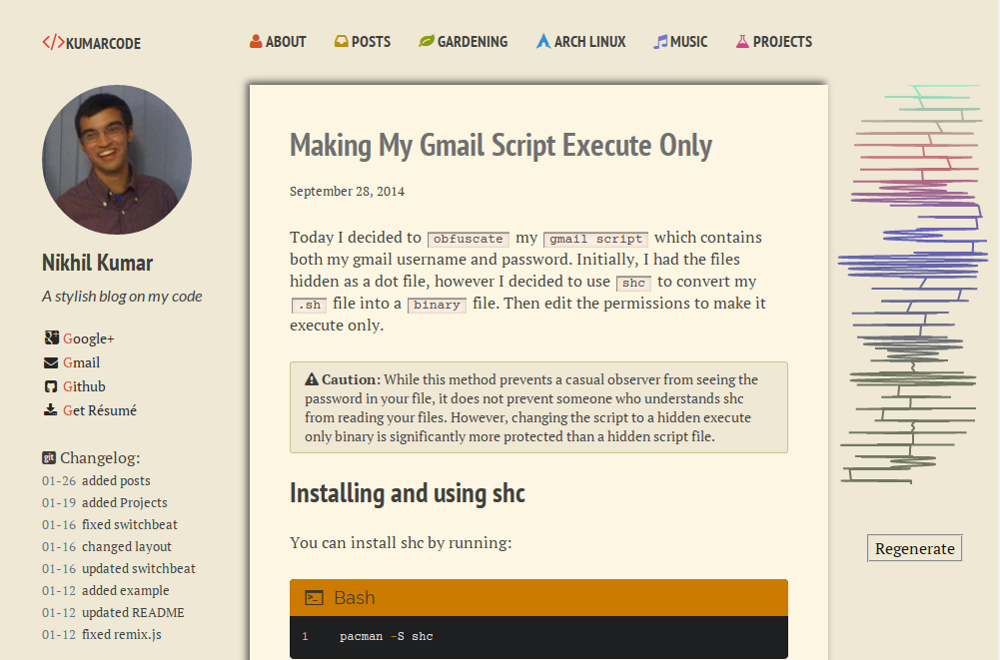

CSS effects are added to posts to make them seem as a raised page.

###Side info

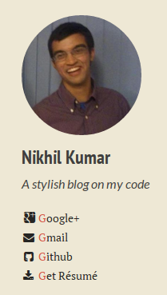

The side info contains a picture of you, a description of you or your website,
and links to contact info/Résumé.

To modify this, you need to modify `_config.yml`.
This is located here:

<blockquote>
/_config.yml
</blockquote>

Here are some of its contents:

```yml

title:            Kumarcode
description:      A stylish blog on my code

url1: http://www.kumarcode.com                  
disqus_shortname: kumarcode

owner:
  name:           Nikhil Kumar
  avatar:         bio-photo.jpg
  bio:            "A stylish blog on my code"
  email:          nikhilkumar516@gmail.com
  twitter:
  facebook:
  github: nikhil
  stackoverflow:
  linkedin:
  instagram:
  lastfm:
  tumblr:
  pinterest:
  foursquare:
  steam:
  dribbble:
  google_plus:  /u/0/104266827599169158890/posts


```

The `bio-photo.jpg` is the picture that would be used to display a picture of
you. The image should be located here:

<blockquote>
/images/bio-photo.jpg
</blockquote>

The info specified above, gets turned into html here:

<blockquote>
/_includes/_author-bio.html
</blockquote>

The code that creates the `Résumé` button is here.

```html
<a href="/resume.pdf" download="resume.pdf" class="author-social" target="_blank">
	<i class="fa fa-download fa-fw">
	</i>
<span class = "socialelm">
<font color="#d34836"> 
G</font>et Résumé
</span>
</a>
```

Your `resume.pdf` must be located here:

<blockquote>
/resume.pdf
</blockquote>

###Git change log

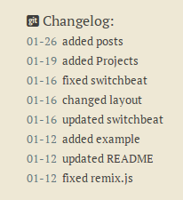

On the bottom of the Side info, I have a section that reads the 8 latests
`git commits` I have made to my website. This lets visitors see when and what
changes I have made. I try to be as brief and as descriptive as possible when
making commit messages.

I use Githubs api to retrieve the commit messages. To personalize this you need
to modify `_author-bio.html`

```js
$.get(
"https://api.github.com/repos/nikhil/nikhil.github.io/commits",
function(data){
	var date;
	var datepart;
	var messagestr;
	var html = '<br><span class = "changeitems">';
	for(i=0;i < 8; i++)
	{	
		messagestr = data[i].commit.message;
		date = data[i].commit.committer.date;
		datepart = date.split("T")[0];
		html += '<font color = "#586e75">'+ datepart.substring(5)+'</font>'+'&nbsp;&nbsp;'+messagestr+ '<br>';
	} 
	html += '</span>';
	$('.changelog').append(html);
	$('.changelog').removeClass('changelog');
	}
)
```

Change the url so that it has your `username` instead of `nikhil` and it should
work for your repo.

###Navigation bar

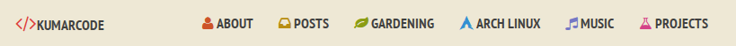

I created a navigation bar that is neat, colorful and legible. You can modify
the links in `_config.yml`. 

```yaml

links:
  - title: About
    url: /about/
    icon: fa fa-user
    count: 1    
  - title: Posts
    url: /posts/
    icon: fa fa-inbox
    count: 2    
  - title: Gardening
    url: /gardening/ 
    icon: fa fa-leaf
    count: 3   
  - title: Arch Linux
    url: /arch/
    icon: icon-arch 
    count: 4   
  - title: music
    url: /music/ 
    icon: fa fa-music
    count: 5    
  - title: projects
    url: /projects/ 
    icon: fa fa-flask 
    count: 6    

```

###Icons

As you can see, I have several icon sets in this template.

* Font Awsome
* Font Mfizz
* IconicIcons

`IconicIcons` is my custom font. I created it to display:

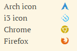


###Cool Code Blocks

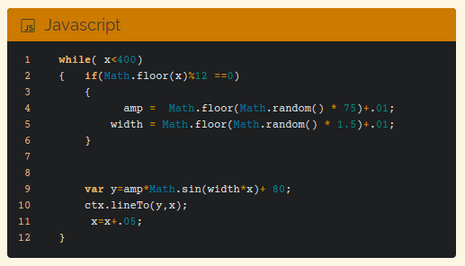

I have developed cool code blocks that will give your code a black background.
If you want to use this, you need to write the `type` of code that is being
shown and its count: first code block =0, second code block =1,...etc.

```yml

---
layout: post
title: Developing Random Math Art
comments: true
code:
- type: html 
  count: 0

- type: javascript
  count: 1

- type: javascript
  count: 2

- type: javascript
  count: 3

- type: javascript
  count: 4

- type: html
  count: 5
 
---

```

The types supported:


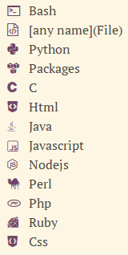


If you specify a type `file`, you can add any name you want. Here is an example
to have a header that says `C3d File`:

```yml

code:
- type: file
  file: C3d File
  count: 0

```

###Footer

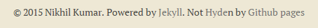

If you do not like the pun, or if your name is not Nikhil Kumar you can modify
the text in `_footer.html` here:

<blockquote>
/_includes/_footer.html
</blockquote>

###Side Math Art

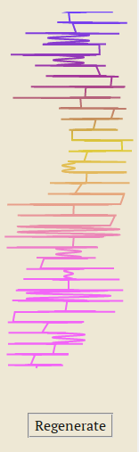

I have written a program in javascript that randomly generates Math art on the
right side of the website. You can modify this in `_side-sine.html` here:

<blockquote>
/_includes/_side-sine.html
</blockquote>

###Loading animation

Here is the animation:


The loading animation  runs when it is loading the image. I have created the
`.gif` myself.   

It is located here:

<blockquote>
/images/loading.gif
</blockquote>

Here is an example on how to use the loading animation for an image:

```html


<script>
$(document).ready(function() {

$(".lazy").unveil();


});
</script>

```


###Linked pages

You can modify how your linked pages (the pages linked to the navigation bar)
look with `markdown files`.

Here is how the posts page looks like:

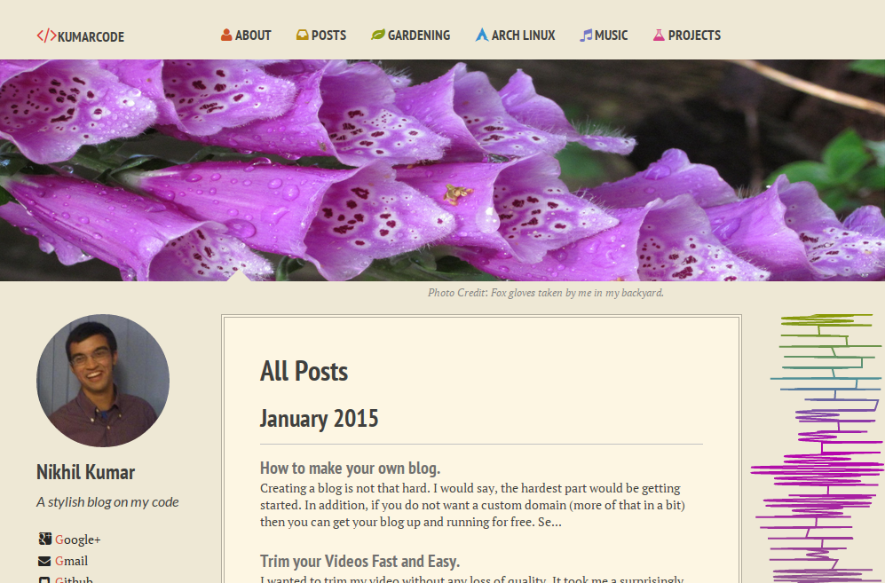

This page is created by `posts.md` located in:

<blockquote>
/_includes/posts.md
</blockquote>

```yml

---
layout: post-index
permalink: /posts/
title: All Posts
tagline: A List of Posts
tags: [blog]
image:
  feature: FoxGloves.jpg
  credit: Fox gloves taken by me in my backyard.

---

```

The `---` here are important and should not be omitted.

###Music Page

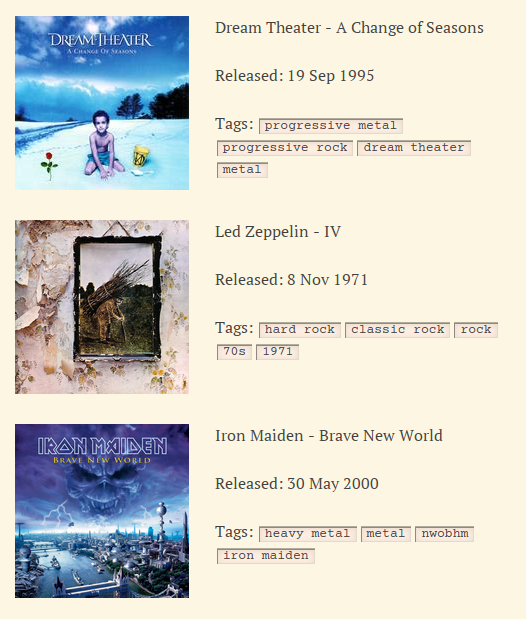


I created a script that uses Last.fm to find and display info about your
favorite albums. All you need to do is create a list of albums you like, and my
script will fetch the artwork, date, and tags.

Here is how to list your albums under `music:`:

```yml

---
layout: page
permalink: /music/
title: Music
tagline: Music
tags: [Music]
modified: 6-28-2014
comments: true
image:
  feature: diantis.jpg
  credit: Diantis taken by me in my backyard.
music:
- name: A Change of Seasons
  by: Dream Theater

- name: Brave New World
  by: Iron Maiden

- name: IV
  by: Led Zeppelin

---
```

###Project Page

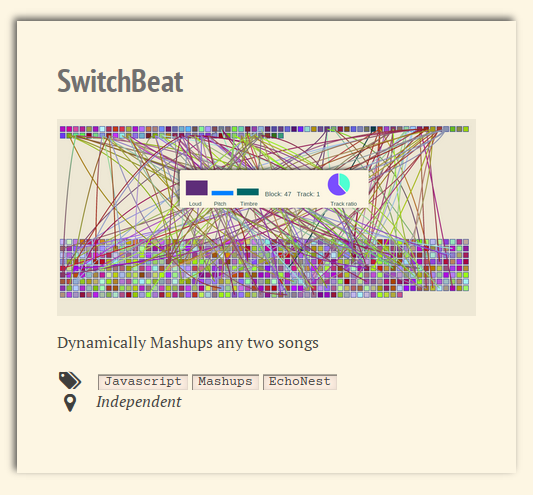

I have created a project template that will create a project page for you,
given the info you provide.

Here is how to list your projects under `programs:`:


```yml

---
layout: page
permalink: /projects/
title: Projects
tagline: 
tags: [projects]
modified: 9-19-2014
comments: true
image:
  feature: rabbit.jpg
  credit: A Rabbit from my backyard.
programs:
- name: PostalPortraits
  url: https://github.com/Erin-Corrado/PostalPortraits
  description: Analyzes the content of a conversation thread on a users email and then transfers those changes through image modifations using the Pillow image manipulation tool.
  images: 
  - image: huskybefore.jpg
  - image: huskyafter.jpg
  location: Rutgers Hackathon Spring 2014
  tags:
  - name: Python
  - name: Context.io
  - name: Pillow
  - name: Email
  prize: Won the Context.io award
- name: SwitchBeat
  url: http://kumarcode.com/switchbeat.html
  description: Dynamically Mashups any two songs
  images: 
  - image: SwitchBeat.png
  location: Independent
  tags:
  - name: Javascript
  - name: Mashups
  - name: EchoNest

---
```

This has multiple image support. You can list as amny images as you want. You
can also use `prize` to indicate if a program won a competition.

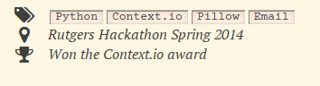

Please let me know if you have any questions.

